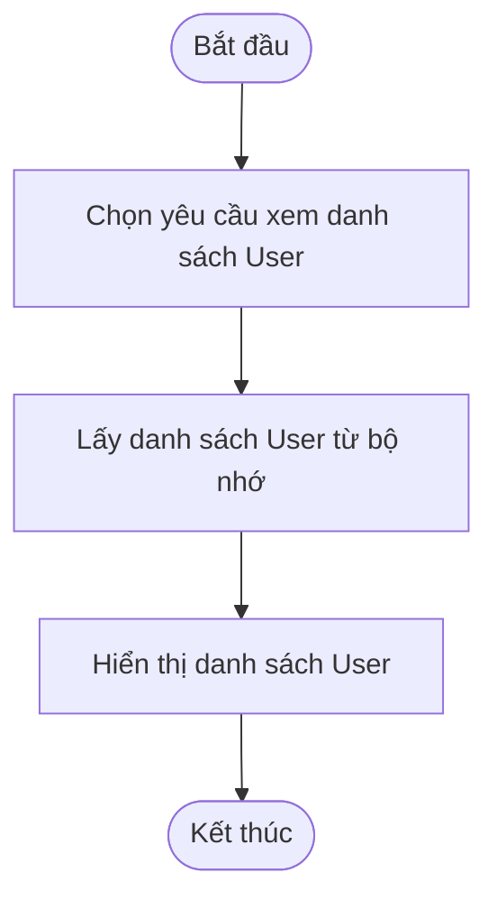

# 00P_N04_25_26_TienDuc_ThanhBinh

## Thành viên nhóm
- **Trần Tiến Đức** – MSV: 23010777  
- **Lê Thanh Bình** – MSV: 23010242  
- **Phạm Thị Lương** – MSV: 23017258 

## 📌 Mô tả dự án
Ứng dụng web âm nhạc được xây dựng bằng **Java Spring Boot** với các chức năng chính:

- **Quản lý âm nhạc**  
  - Thêm, sửa, xóa bài hát  
  - Liệt kê thông tin bài hát  
  - Lọc bài hát theo playlist hoặc album  

- **Quản lý playlist & album**  
  - Thêm, sửa, xóa playlist/album  
  - Gán bài hát vào playlist hoặc album  

- **Quản lý dữ liệu**  
  - Lưu trữ dữ liệu xuống file nhị phân  
  - Khi làm việc trong bộ nhớ, dữ liệu được quản lý bằng các **Collection** như `ArrayList`, `LinkedList`, `Map`, …  


## Sơ đồ UML
### 1.1 UML Class Diagram


### 1.2 Sequence Diagram

### 1.3 Activity Diagram (CRUD)

#### Playlist


#### User

**Create**
**Create**


**Read**


**Update**


**Delete**

## Activity Diagram CRUD Song  

### Create Song
```mermaid
flowchart TD
    A([Start]) --> B[Nhập thông tin bài hát]
    B --> C{Dữ liệu hợp lệ?}
    C -- Không --> D[Hiển thị lỗi] --> G([End])
    C -- Có --> E[Lưu bài hát vào Repository/DB]
    E --> F[Thông báo thành công]
    F --> G([End])

### Read Song
```mermaid
flowchart TD
    A([Start]) --> B[Yêu cầu danh sách bài hát]
    B --> C[Lấy danh sách từ Repository/DB]
    C --> D[Hiển thị danh sách]
    D --> E([End])

### Update Song
```mermaid
flowchart TD
    A([Start]) --> B[Chọn bài hát cần sửa]
    B --> C[Hiển thị thông tin cũ]
    C --> D[Nhập thông tin mới]
    D --> E{Dữ liệu hợp lệ?}
    E -- Không --> F[Hiển thị lỗi] --> I([End])
    E -- Có --> G[Cập nhật bài hát trong Repository/DB]
    G --> H[Thông báo thành công]
    H --> I([End])

### Delete Song
```mermaid
flowchart TD
    A([Start]) --> B[Chọn bài hát cần xóa]
    B --> C{Xác nhận xóa?}
    C -- Không --> E([End])
    C -- Có --> D[Xóa bài hát khỏi Repository/DB]
    D --> F[Thông báo thành công]
    F --> E([End])
