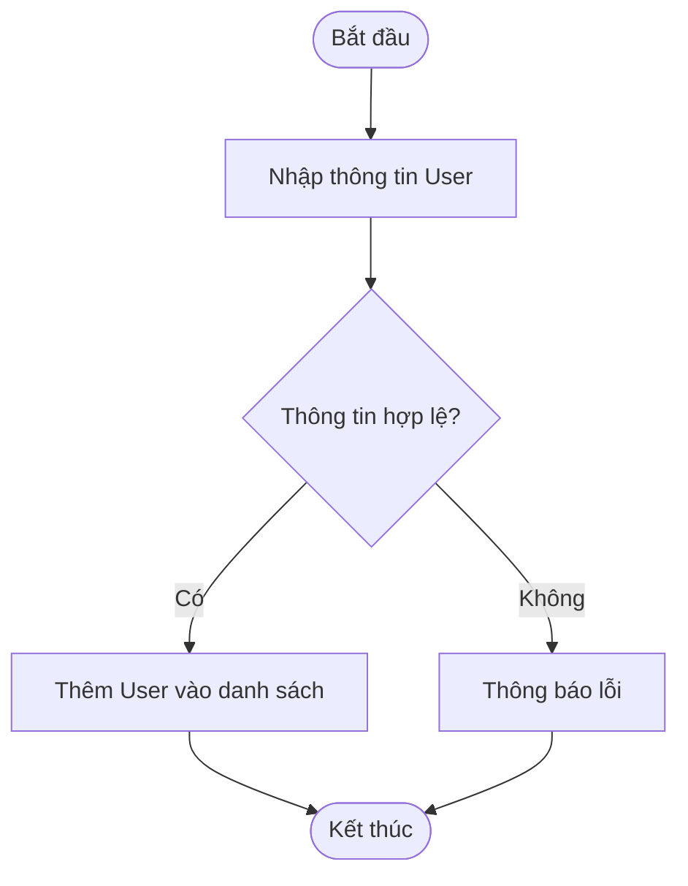
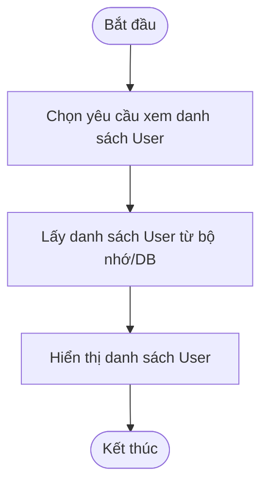

-----

# 🎵 MusicApp - Quản lý Âm nhạc (OOP Project)

Mã học phần: `00P_N04_25_26` | Nhóm: `Group11_OOP_NO2_term3_2025`

[](https://www.java.com)
[](https://spring.io/projects/spring-boot)
[](https://www.mysql.com/)
[](https://www.thymeleaf.org/)

> Ứng dụng web âm nhạc được xây dựng bằng **Java Spring Boot** và **Thymeleaf** với mục tiêu giúp người dùng quản lý thư viện nhạc cá nhân của mình một cách hiệu quả.

## 📋 Mục lục

  * [I. Thành viên nhóm](https://www.google.com/search?q=%23i-th%C3%A0nh-vi%C3%AAn-nh%C3%B3m)
  * [II. Tính năng chính](https://www.google.com/search?q=%23ii-t%C3%ADnh-n%C4%83ng-ch%C3%ADnh)
  * [III. Các công nghệ sử dụng](https://www.google.com/search?q=%23iii-c%C3%A1c-c%C3%B4ng-ngh%E1%BB%87-s%E1%BB%AD-d%E1%BB%A5ng)
  * [IV. Cấu trúc dự án](https://www.google.com/search?q=%23iv-c%E1%BA%A5u-tr%C3%BAc-d%E1%BB%B1-%C3%A1n)
  * [V. Hướng dẫn cài đặt và chạy](https://www.google.com/search?q=%23v-h%C6%B0%E1%BB%9Bng-d%E1%BA%ABn-c%C3%A0i-%C4%91%E1%BA%B7t-v%C3%A0-ch%E1%BA%A1y)
  * [VI. Thiết kế hệ thống (UML)](https://www.google.com/search?q=%23vi-thi%E1%BA%BFt-k%E1%BA%BF-h%E1%BB%87-th%E1%BB%91ng-uml)
      * [6.1 Sơ đồ Lớp (Class Diagram)](https://www.google.com/search?q=%2361-s%C6%A1-%C4%91%E1%BB%93-l%E1%BB%9Bp-class-diagram)
      * [6.2 Sơ đồ Tuần tự (Sequence Diagram)](https://www.google.com/search?q=%2362-s%C6%A1-%C4%91%E1%BB%93-tu%E1%BA%A7n-t%E1%BB%B1-sequence-diagram)
      * [6.3 Sơ đồ Hoạt động (Activity Diagram)](https://www.google.com/search?q=%2363-s%C6%A1-%C4%91%E1%BB%93-ho%E1%BA%A1t-%C4%91%E1%BB%99ng-activity-diagram)

-----

## I. Thành viên nhóm

| Họ tên | MSSV |
| :--- | :--- |
| Trần Tiến Đức | `23010777` |
| Lê Thanh Bình | `23010242` |
| Phạm Thị Lương | `23017258` |

-----

## II. Tính năng chính

Ứng dụng cung cấp các chức năng CRUD (Create, Read, Update, Delete) đầy đủ cho các đối tượng chính:

  * **Quản lý Âm nhạc**
      * Thêm, sửa, xóa thông tin bài hát (tên, nghệ sĩ, thể loại).
      * Liệt kê danh sách tất cả bài hát.
      * Lọc/Tìm kiếm bài hát.
  * **Quản lý Playlist & Album**
      * Tạo, sửa, xóa playlist/album.
      * Thêm bài hát vào một playlist hoặc album cụ thể.
      * Xem tất cả bài hát trong một playlist/album.
  * **Quản lý Dữ liệu**
      * Lưu trữ và đọc dữ liệu từ file nhị phân (cho mục đích demo/dữ liệu ban đầu).
      * Kết nối và thao tác với cơ sở dữ liệu MySQL.
      * Sử dụng các cấu trúc dữ liệu Java Collection (`ArrayList`, `Map`,...) để xử lý logic nghiệp vụ trong bộ nhớ.

-----

## III. Các công nghệ sử dụng

| Lĩnh vực | Công nghệ |
| :--- | :--- |
| **Backend** | \ (Java 17, Spring Boot, Maven) |
| **Frontend** | \ (HTML, CSS, Thymeleaf) |
| **Database** | \ (MySQL) |
| **Version Control** | \ (Git, Github) |
| **IDE** | \ (VSCode, IntelliJ IDEA) |

-----

## IV. Cấu trúc dự án

Dự án được tổ chức theo kiến trúc Model-View-Controller (MVC) tiêu chuẩn của Spring Boot.

```bash
musicapp/
├── .mvn/
├── src/
│   ├── main/
│   │   ├── java/com/musicapp/
│   │   │   ├── model/       # Các lớp Entity (Song, Playlist, Album, User)
│   │   │   ├── repository/  # Giao tiếp với CSDL (JPA Repository)
│   │   │   ├── service/     # Xử lý logic nghiệp vụ (Business Logic)
│   │   │   ├── controller/  # Điều khiển request, trả dữ liệu cho view
│   │   │   └── MusicAppApplication.java # File main khởi chạy Spring Boot
│   │   └── resources/
│   │       ├── static/      # Chứa CSS, JS, Images
│   │       ├── templates/   # Giao diện Thymeleaf (HTML)
│   │       └── application.properties # Cấu hình database, cổng, logging
└── pom.xml                  # File quản lý thư viện (Maven)
```

-----

## V. Hướng dẫn cài đặt và chạy

### 1\. Yêu cầu tiên quyết

  * **Java JDK 17** (hoặc cao hơn)
  * **Maven 3.8** (hoặc cao hơn)
  * **MySQL Server 8.0**

### 2\. Các bước cài đặt

**1. Clone Repository**

```bash
git clone [ĐƯỜNG DẪN REPO CỦA BẠN]
cd [TÊN THƯ MỤC DỰ ÁN]
```

**2. Cấu hình Cơ sở dữ liệu (MySQL)**

  * Mở MySQL Workbench hoặc terminal và tạo một database mới:
    ```sql
    CREATE DATABASE music_db;
    ```
  * Mở file `src/main/resources/application.properties`.
  * Cập nhật thông tin kết nối database của bạn:
    ```properties
    # Database Connection
    spring.datasource.url=jdbc:mysql://localhost:3306/music_db
    spring.datasource.username=root
    spring.datasource.password=[MẬT KHẨU CỦA BẠN]

    # JPA/Hibernate
    spring.jpa.hibernate.ddl-auto=update
    spring.jpa.show-sql=true
    ```
    *(Lưu ý: `ddl-auto=update` sẽ tự động tạo/cập nhật các bảng dựa trên các lớp Model của bạn.)*

**3. Chạy ứng dụng**

  * Sử dụng Maven để build và chạy dự án:
    ```bash
    mvn spring-boot:run
    ```
  * Hoặc bạn có thể chạy file `MusicAppApplication.java` từ IDE của mình.

**4. Truy cập ứng dụng**

  * Mở trình duyệt và truy cập vào địa chỉ: `http://localhost:8080`

-----

## VI. Thiết kế hệ thống (UML)

### 6.1 Sơ đồ Lớp (Class Diagram)

Sơ đồ lớp mô tả cấu trúc tĩnh của hệ thống, bao gồm các lớp, thuộc tính và mối quan hệ giữa chúng.

\

### 6.2 Sơ đồ Tuần tự (Sequence Diagram)

*(Phần này cần được bổ sung để mô tả luồng tương tác giữa các đối tượng, ví dụ: "User thêm một Bài hát vào Playlist".)*

### 6.3 Sơ đồ Hoạt động (Activity Diagram)

#### CRUD: Playlist

Sơ đồ mô tả luồng hoạt động khi người dùng quản lý Playlist.

\

#### CRUD: User

Sơ đồ mô tả các luồng hoạt động cơ bản cho việc quản lý Người dùng (User).

**1. Create (Tạo mới)**



**2. Read (Đọc/Xem)**



**3. Update (Cập nhật)**


**4. Delete (Xóa)**


#### CRUD: Song (Bài hát)

*(Phần này cần được bổ sung, tương tự như Sơ đồ hoạt động của User và Playlist.)*

-----

